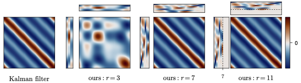

# Rank-Reduced Kalman filtering (RRKF) experiments

Code accompanying the pre-print *"The Rank-Reduced Kalman Filter: Approximate
Dynamical-Low-Rank Filtering In High Dimensions"* ([arXiv](http://arxiv.org/abs/2306.07774)).

## Source code

Please find the source code used by the experiments [here](https://github.com/schmidtjonathan/RRKF.jl) (https://github.com/schmidtjonathan/RRKF.jl).